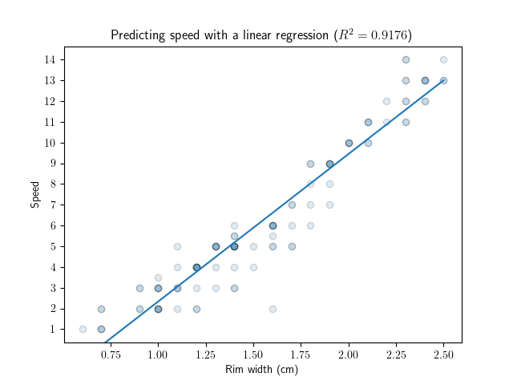
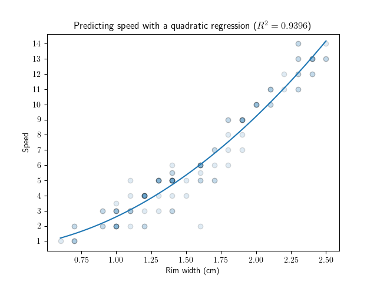

The growing sport of disc golf is a variation on traditional (ball) golf, but with players attempting to throw flying discs at a target instead of attempting to hit a ball into a hole. The Professional Disc Golf Assocation (PDGA) approves discs for professional play and maintains a registry of a few physical characteristics of registered discs. The image below, taken from the PDGA technical standards document, shows the cross section of a disc with a number of measurements marked, several of which are registered with the PDGA.


The variation in disc shapes leads to different flight characteristics. 
# The data

The PDGA makes their database of physical characteristics available for download, which we named `pdga.csv` and made availabile by calling `get_df_pdga()`.
```python
>>> from loader import get_df_pdga
>>> df = get_df_pdga()
>>> print(df)
                    manufacturer                                              model  ...  rim_config  flexibility
0     Newb SimHouse Custom Discs                                         NSH5 Sweed  ...       30.00         5.34
1     Newb SimHouse Custom Discs                                        NSH6 StackS  ...       62.50         7.61
2          Innova Champion Discs                                            Grenade  ...       71.75         7.95
3                Divergent Discs                                              Alpas  ...       53.00         1.14
4                Divergent Discs                                             Kraken  ...       28.75        12.05
...                          ...                                                ...  ...         ...          ...
1327                Wham-O, Inc.  165g (80, 81, 81C, 81E, 82E & 900 molds & High...  ...       94.75         4.76
1328                Wham-O, Inc.  Super Pro (no #, 50, 60, 61, 61N, 61B, 62, 62N...  ...       86.00         2.38
1329                Wham-O, Inc.                               Fastback (all molds)  ...       79.50         2.49
1330                Wham-O, Inc.                                             Master  ...       83.75         4.08
1331                Wham-O, Inc.  Professional (1, 4, 10, 14, 15, 16, 17, 20, 20...  ...       89.00         3.18

[1332 rows x 11 columns]
```
The columns include the manufacturer and model name of each disc together with the nine physical characteristics that the PDGA registers:

```python
>>> for col in df.columns:
...     print(col)
... 
manufacturer
model
max_weight
diameter
height
rim_depth
inside_rim_diameter
rim_thickness
rim_depth_to_diameter
rim_config
flexibility
```


Some of the discs have null entries. 
```python
>>> df[df.isnull().any(axis=1)]
               manufacturer               model  max_weight  ...  rim_depth_to_diameter  rim_config  flexibility
1079                Aerobie         Epic Driver       175.1  ...                    5.2        26.5        12.02
1282  Disc Golf Association         Streamliner       180.1  ...                    7.8        40.0          NaN
1289  Disc Golf Association  Softtouch (larger)       195.1  ...                    7.2        77.0          NaN

[3 rows x 11 columns]
```
The method `get_df_pdga_quantitative()` returns a dataframe that removes these rows and turns the qualitative columns `manufacturer` and `model` into indexes:
```python
>>> from loader import get_df_pdga_quantitative()
>>> df = get_df_pdga_quantitative()
>>> print(df)
                                     max_weight  diameter  ...  rim_config  flexibility
manufacturer   model                                       ...                         
1080 Disc Golf Radius                     175.1      21.1  ...       51.75         7.03
ABC Discs      Bee Line                   175.1      21.1  ...       26.25         8.39
               Flying Squirrel            181.8      21.9  ...       30.75         3.52
               Gamma Ray                  174.3      21.0  ...       29.75        11.68
               Mission                    180.9      21.8  ...       39.25         6.12
...                                         ...       ...  ...         ...          ...
Yikun Discs    Wei (精卫)                   175.1      21.1  ...       30.25        10.55
               Wings (翼)                  176.0      21.2  ...       56.75         7.48
               Xing (刑天, Xing Tian)       176.8      21.3  ...       71.00         6.82
               Yan (朱厌, Zhu Yan)          181.8      21.9  ...       49.00         9.77
               Yao (文鳐鱼)                  179.3      21.6  ...       39.75        12.02

[1329 rows x 9 columns]
```

Seven of the nine columns (diameter, height, rim depth, inside rim diameter, rim configuration, and flexibility) are physical measurements, while the remaining two are calculated from phyiscal measurements. The maximum weight of a disc (`max_weight`) is either 200 grams and or 8.3 grams times the outside diameter of the disc (in centimeters), whichever is lower, and the PDGA also insists that the rim depth is between 5 and 12 percent of the outside diameter, so the ratio of the rim depth to the outside diameter is recorded as the column `rim_depth_to_diameter`.

A scatterplot of the dataset against each pair of features is presented below (produced with `correlations.plot_all_pairs()`)


We can restrict to only show those plots that are significanly positively or negatively correlated using `correlations.plot_significant_correlations()`:


## Feature Prediction

The variations in disc shape lead to different flight patterns—some discs fly faster than others, some generate more lift, etc. Many disc manufacturers do their best to summmarize these flight characteristics with four "flight numbers", namely speed, glide, turn, and fade. How well can we predict these flight numbers using the PDGA-registered physical characteristics of the discs? 

This short project aims to use polynomial regression on the PDGA-registered measurements to predict the flight numbers of Innova-brand discs.

The flight numbers assigned to discs are not entirely objective but are considered much more consistent if we restrict only to discs produced by one manufacturer. Innova has the most PDGA-approved discs among all manufacturers, and many in the sport look to model their flight numbers after Innova's, so they were the natural choice to analyze. 

Innova has 157 PDGA-approved discs, which we load into a dataframe:
```python
>>> df = get_df_by_mfr('Innova Champion Discs')
>>> print(df)
            max_weight  diameter  height  ...  rim_depth_to_diameter  rim_config  flexibility
model                                     ...                                                
Ace              175.1      21.1     1.6  ...                    5.7       27.75        10.09
Aero             180.1      21.7     2.5  ...                    6.0       43.75         8.16
Animal           176.0      21.2     2.1  ...                    6.1       64.00         9.66
Ape              175.1      21.1     1.5  ...                    5.7       27.75        12.13
Apple            200.0      26.4     3.2  ...                    7.6       93.25         4.99
...                ...       ...     ...  ...                    ...         ...          ...
Wombat3          180.9      21.8     2.0  ...                    6.4       30.00         7.26
Wraith           175.1      21.1     1.4  ...                    5.7       26.75         8.85
XCaliber         175.1      21.1     1.6  ...                    5.7       29.50         8.85
XT V-Aviar       175.1      21.1     2.0  ...                    6.6       55.75         8.85
Zephyr           200.0      24.1     2.7  ...                    7.1       83.00        10.00

[157 rows x 9 columns]
```

The flight numbers of Innova discs aren't as easily available as the physical characteristics. We obtained many (106) of them off the [Innova website](https://www.innovadiscs.com/disc-golf-discs/disc-comparison/) and were able to find 21 more through internet searches. These flight numbers are recorded in `innova.csv`, and a dataframe with both the PDGA-registered features and the flight numbers is made available with `loader.get_df_innova()`:
```python
>>> df = get_df_innova()
>>> df
           max_weight  diameter  height  rim_depth  ...  speed  glide  turn  fade
model                                               ...                          
Ace             175.1      21.1     1.6        1.2  ...    2.0    3.0  -2.0   1.0
Aero            180.1      21.7     2.5        1.3  ...    3.0    6.0   0.0   0.0
Animal          176.0      21.2     2.1        1.3  ...    2.0    1.0   0.0   1.0
Ape             175.1      21.1     1.5        1.2  ...   13.0    5.0   0.0   4.0
Archangel       175.1      21.1     1.6        1.5  ...    8.0    6.0  -4.0   1.0
...               ...       ...     ...        ...  ...    ...    ...   ...   ...
Wombat          180.9      21.8     2.2        1.4  ...    5.0    6.0  -1.0   0.0
Wombat3         180.9      21.8     2.0        1.4  ...    5.0    6.0  -1.0   0.0
Wraith          175.1      21.1     1.4        1.2  ...   11.0    5.0  -1.0   3.0
XCaliber        175.1      21.1     1.6        1.2  ...   12.0    5.0   0.0   4.0
Zephyr          200.0      24.1     2.7        1.7  ...    2.0    3.0   0.0   0.0

[112 rows x 13 columns]
```

# Linear Regression
## Speed

The "speed" of a disc is a measure of how quickly the disc moves through the air. The speed of a disc is relatively well-predicted by the width of the rim of the disc.




<!-- ## Glide

The "glide" of a disc is a measure of how much lift the disc generates and thus how long it will stay airborne. The glide of a disc is not well-explained by any of


 -->
